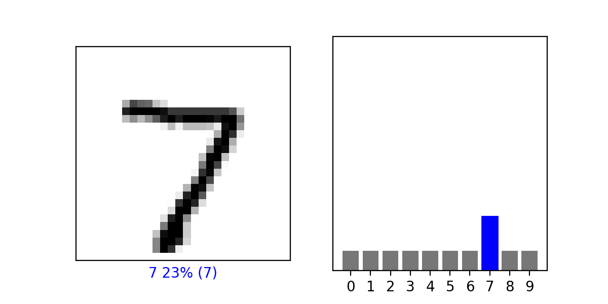
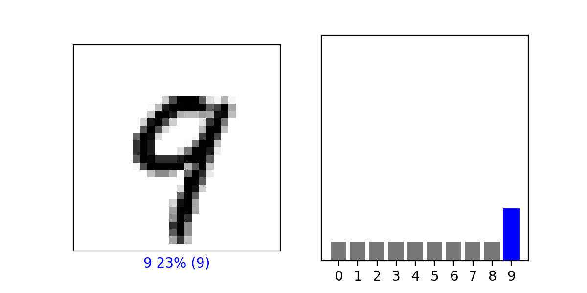

### What is the purpose of splitting the data into a training set and a test set?

The purpose of splitting the data into training and testing sets is to provide an accurate error measure for the network. If the accuracy of the network was determined by using the data the network trained on, then it would overperform and that error rate would not generalize well. Having a testing set that is not involved in the training of the network demonstrates how well the network will perform with data it has never seen before. This is useful because ultimately the network will be utilized to predict outputs that the programmer does not know.

### The last two are .Dense layers that have activation arguments using the relu and softmax functions. What is the purpose of each of these functions. Also, why are there 10 neurons in the third and last layer in the neural network?

The activation arguments (relu and softmax) in the last two layers optimize the performance of the network. The relu function squashes the input into a range from 0 to 1. This increases the speed of training the network, as it does not have to deal with complex levels of activation. The softmax function creates a probility distribution for the 10 classes (10 neurons of the third and last layer) and determines which one has the highest predicted probabilty. 

### How do the optimizer and loss functions operate to produce model parameters (estimates) within the model.compile() function?

The loss function determines the inaccuracy of the model on a given epoch. The optimizer utilizes the loss value to 'step' in an optimal direction along the loss function in order to reduce loss and increase accuracy. 

### Using the mnist drawings dataset (the dataset with the hand written numbers with corresponding labels) answer the following questions.
  #### What is the shape of the images training set (how many and the dimension of each)?
  
  (60000, 28, 28): 60,000 28x28 pixel images.
  
  #### What is the length of the labels training set?
  
  60000 labels. Each label is a value 0-9.
  
  #### What is the shape of the images test set?
  
  (10000, 28, 28): 10,000 28x28 pixel images.
  
  #### Estimate a probability model and apply it to the test set in order to produce the array of probabilities that a randomly selected image is each of the     possible numeric outcomes. Use np.argmax() with your predictions object to return the numeral with the highest probability from the test labels dataset. Produce a plot of your selected image and the accompanying histogram that illustrates the probability of that image being the selected number
  
  
  
  
  
  
  
  

