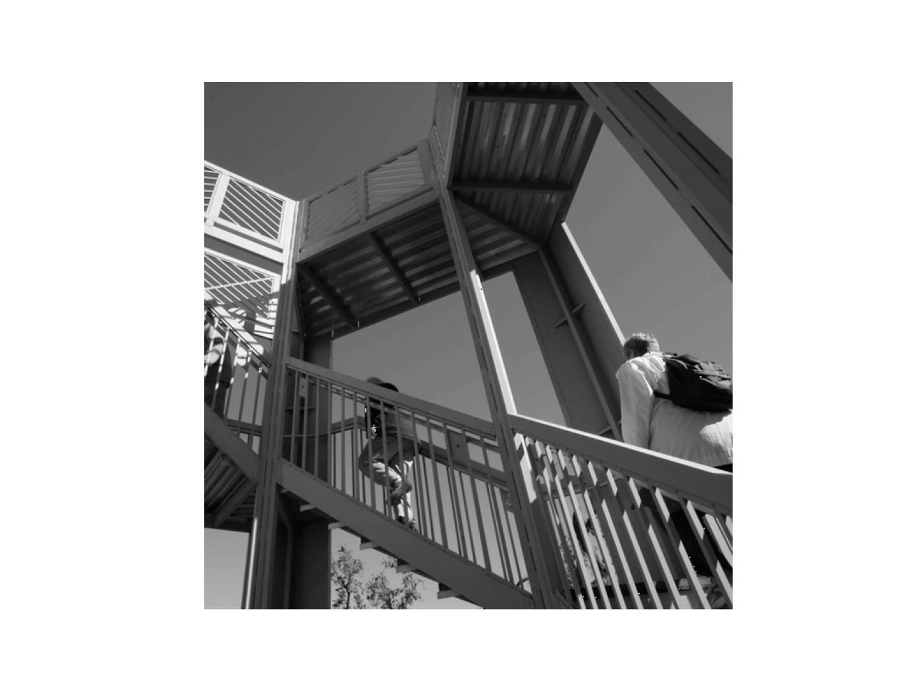
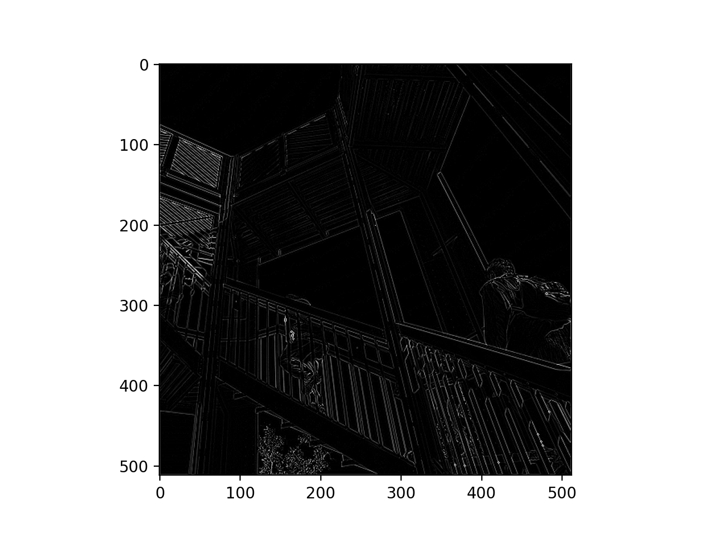
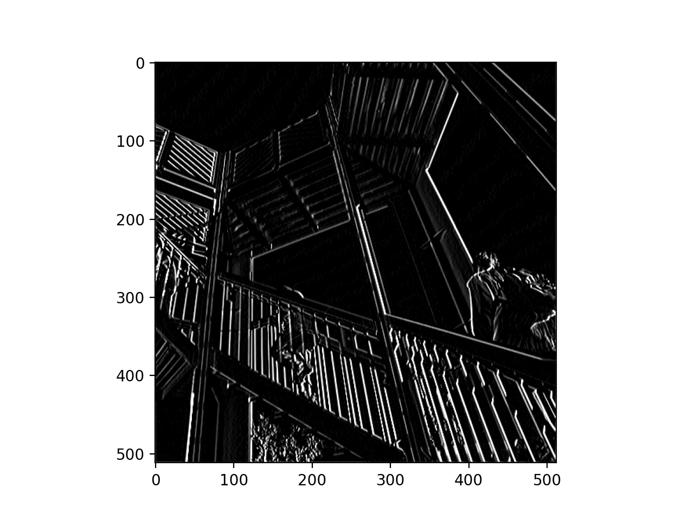
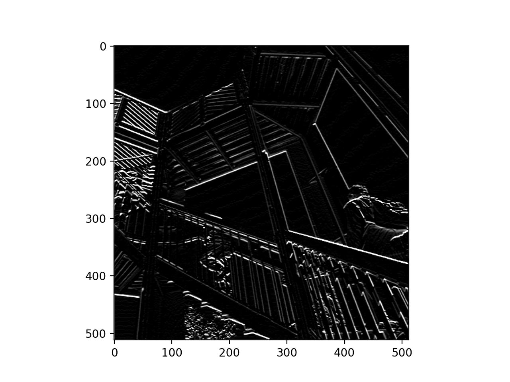
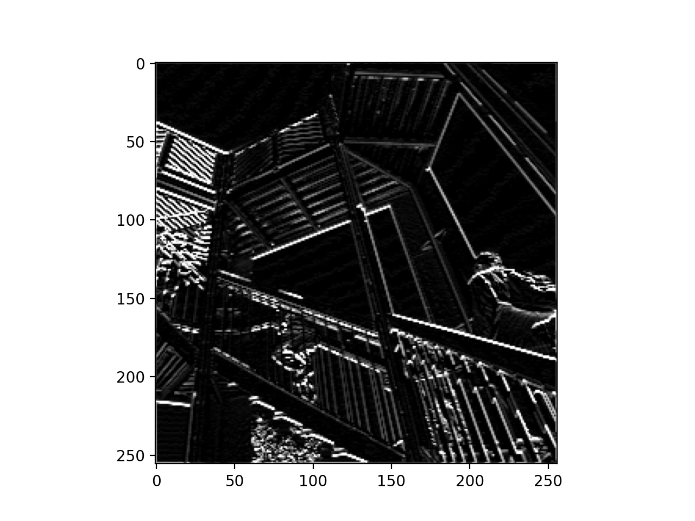

### Apply three filters to image:

#### Here is the original image:

#### Here is the image convolved with filter one:

This filter highlighted (detected) the background diagonal lines in the image.

#### Here is the image convolved with filter two:

This filter highlighted (detected) the vertical lines in the image. 

#### Here is the image convolved with filter three:

This filter highlighted (detected) the horizontal lines in the image. 

### What are you functionally accomplishing by applying these filters to your original array? Why is this useful?

Each filter has three sets of arrays with three integers in each. Each integer in each array is applied to a corresponding integer pixel value in the original image. This distorts the image, i.e. highlighting certain aspects of the image based on the interger values in the filter. This is useful because it allows the network to more accurately associate distinct features in an image with the output.

### Apply 2x2 pooling filter to image:

#### Here is the image convoled with filter three and pooled with a filter of dimension 2x2:

### What have you accomplished with pooling? Which type of filter pooling is applied? Did the result increase or decrease in size?

This pooling has made the image a quarter as big. The pooling used is max pooling. A filter of size 2x2 was iteratively slid across the original pixel values of the image, and the largest of those four pixels was extracted as the value for the new pooled image. In this particular section of code, an empty list called "pixels" is created. Then each of the four pixels in the 2x2 filter is appended to the list. The list is then reverse sorted, and the first item (largest item due to reverse sort) in the "pixel" list is kept for the new image. The pooled image is smaller in size. This technique is useful for machine learning because it reduces the amount of data that the network needs to process, and in some cases makes important features more distinct. 

### What would the output be from the 3x3 kernel convolving the 9x9 input image?

The output from this convolution would be a layer that is 7x7. 

