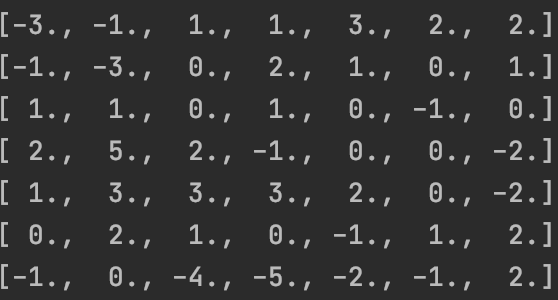
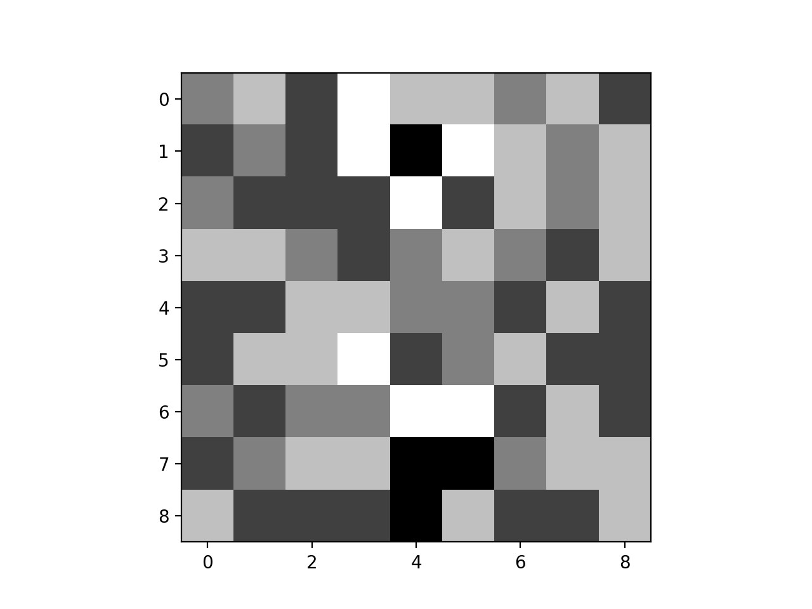
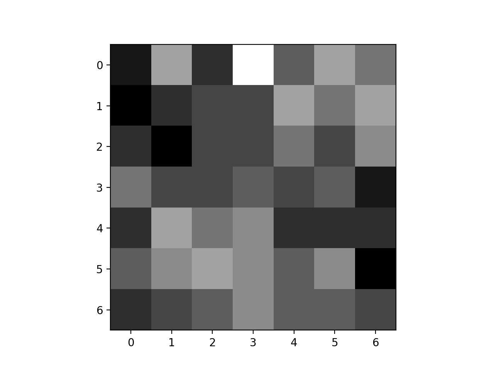

### Convolve 9x9 matrix with two 3x3 filters: 

#### Here are my original matrices:

#### Output from the convolution with the first filter:

#### Output from the convolution with the second filter:

#### Plot of the original 9x9 matrix:

#### Plot of the first convolution output:

#### Plot of the second convolution output: 

### What is the purpose of using a 3x3 filter to convolve across a 2D image matrix?

The purpose of performing this convolution is to highlight certain features in the initial matrix. Convolving a matrix with different filters will provide different results, with different elements of the original matrix highlighted. The purpose of using a 2D matrix instead of a 1D matrix is that a 2D matrix provides more data than a 1D matrix does. A 2D matrix will inherently provide two spatial locations for a point of data, while a 1D matrix only has one. Therefore, if you were to condense a 2D matrix into a 1D matrix, you would be removing a lot of information about the data that may help a network perform better. The spatial location of a data point with respect to other datapoints, is itself, valuable data.

### Why would we include more than one filter? How many filters did you assign as part of your architecture when training a model to learn images of numbers from the mnist dataset?

Using more than one filter simply allows the network to detect more features. One filter may be effective at highlighting vertical lines, while another filter is effective at highlighting horizontal lines for example. 

