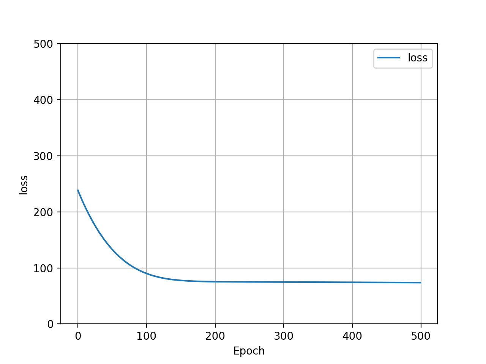
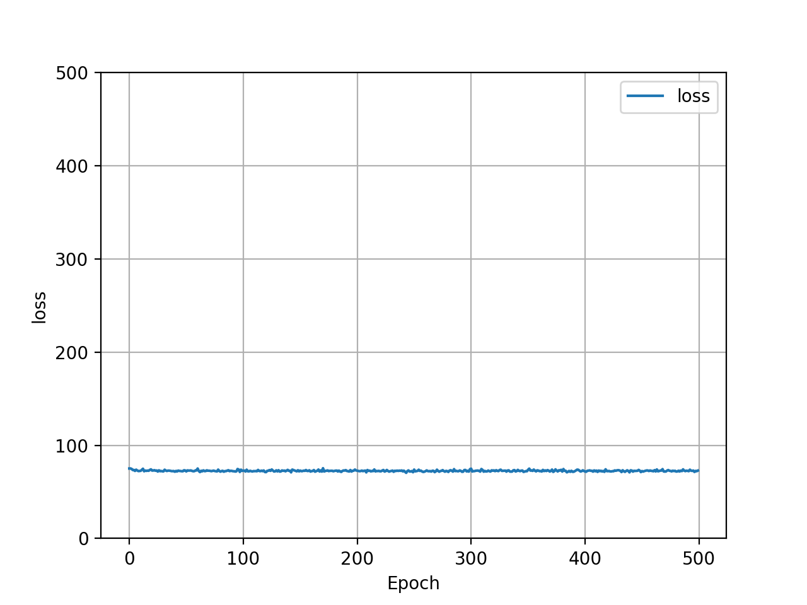
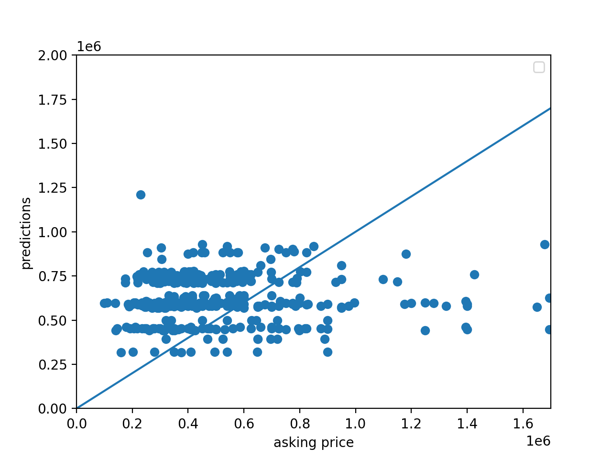
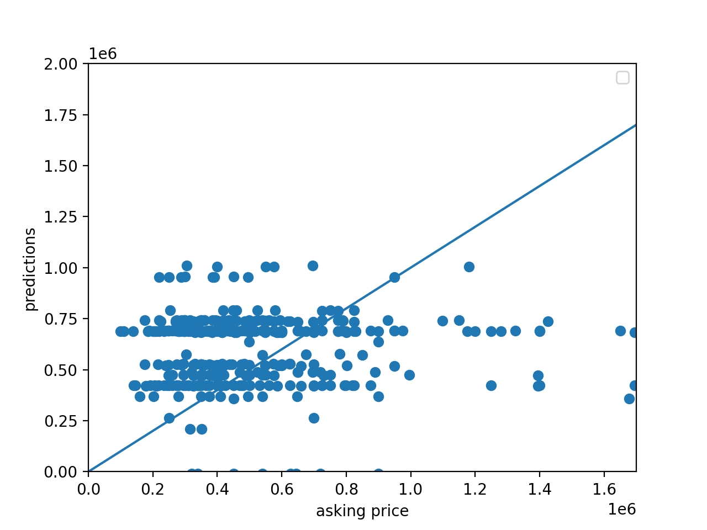

I scraped 400 observations from Zillow pertaining to the housing market in Austin, TX. I selected Austin as the target city... for obvious reasons. Each observation contained 5 data points: 'asking price', 'address', 'number of beds', 'number of bathrooms', and 'square-footage'. This data was condensed into a single csv. 

The independant variables: 'number of beds', 'number of bathrooms', and 'square-footage' were used to train a neural network to predict the dependant variable: 'asking price'. The objective of this network was to determine whether the asking price for a particular property was reasonable. This was achieved by comparing the outputs from the network to the official asking price for the property. 

The network was comprised of a single dense (fully-connected) layer contained one neuron with an input shape of 3. Initially I utilized 'sgd' as the optimizer, however in later training iterations I utilized 'adam' as the optimizer. The loss function utilized for training was 'mean squared error'. 

The preprocessing of the data after scraping from Zillow was the most challenging aspect of this project. The 'square-footage' column in the resultant csv from the scrape contained string values, which needed to be cast into int values for the purpose of network training. Generally, this is a straight-forward operation. However, there were 10 data points in the 'square-footage' column that could not be cast into numeric values (int, float). The source of this error was too difficult to identify. I was able to circumvent this issue by implimenting the following block of code:

      homes = pd.read_csv('zillow_data.csv')
      homes['sqft'] = pd.to_numeric(homes['sqft'], errors='coerce')
      sqft_mean = np.mean(homes['sqft'])
      homes = homes.fillna(sqft_mean)

The first line of code reads the csv into a pandas dataframe. The second line of code converts the 'square-footage' column in the dataframe to int values. The " errors='coerce' " arguement in the second line makes the 10 data points that could not be cast to numeric values into 'NaN' values. The third line of code calculates the mean value of 'square-footage' for all of the data in the dataframe. The fourth and final line of code replaces the 10 'NaN' values created in line two of the code, into the mean 'square-footage' value of the data. This was done because the network was unable to train on data with 'NaN' values. While replacing the 'NaN' values with the mean likely skewed the data somewhat, it was the only way that the network could successfully train on all 400 observations. I used the mean value of 'square-footage' because it would best mitigate any inaccuracies resulting from this augmentation. 

Here is a graphical comparison of Adam and SGD optimizers impact on the loss of the model: 

Adam Optimizer - Loss Graph           |  SGD Optimizer - Loss Graph
:-------------------------:|:-------------------------:
  |  

Here is a graphical comparison of Adam and SGD optimizers impact on the model's predicted price: 

Adam Optimizer - Price Scatter Plot           |  SGD Optimizer - Price Scatter Plot
:-------------------------:|:-------------------------:
  |  

Based on these outputs, it looks as though the two optimizers performed eqivilently. This was most likely due to the complexity of the target function and the reletive simplicity of the model. As a result of this, variance in the optimizer had little to do output improvement. This would likely start to impact the effectiveness of the output with a more complex model. One interesting variation between the two optimizers was Adam's initial poor loss performance, and quick improvement. SGD on the other hand started with a lower loss and improved only minorily, if at all. Both optimizers completed 500 epochs with approximately the same loss value.

Raw : The Mean Squared Error is:  712637506427.6313
SS : The Mean Squared Error is:  711190659063.013
MMS : The Mean Squared Error is:  746906436004.5992
ROB : The Mean Squared Error is:  1155790503522.1743

