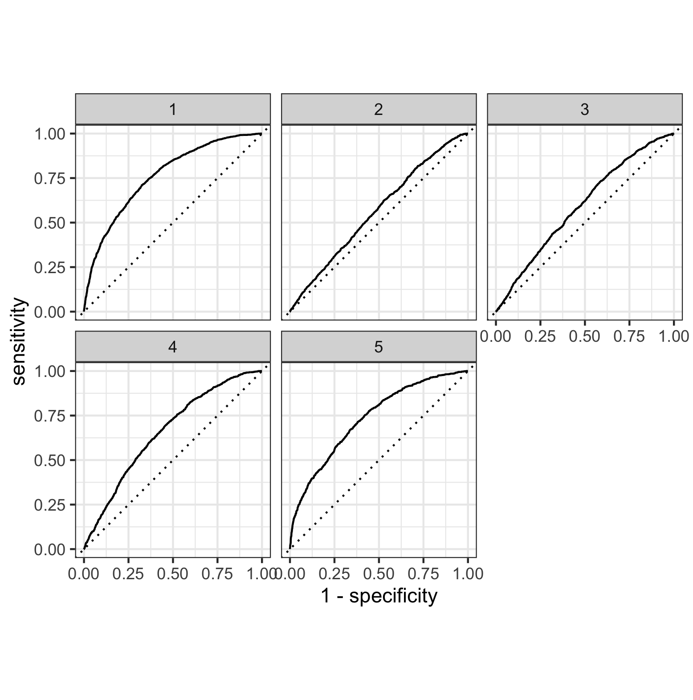
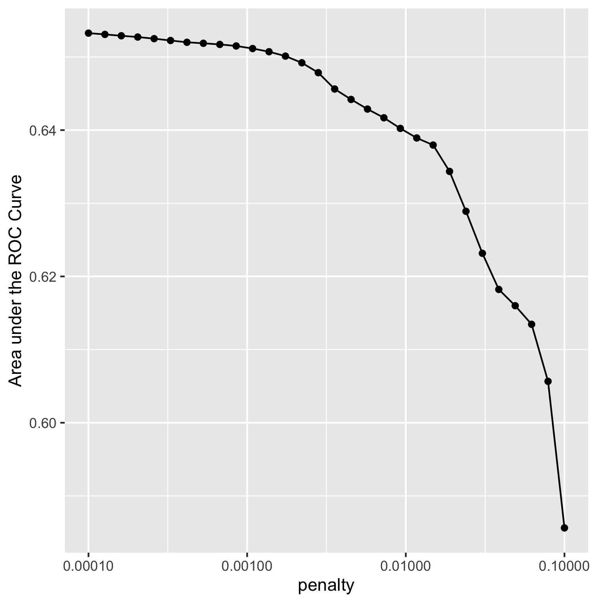

# Top Model

Based on this figure, the model with the largest area under curve was model one. Model five also had a large area under curve, however when calculating the area, model one was the largest. This indicates that model one was the most effective. I was able to use the feature selection penalty, however it did not appear to have a positive effect on the area under the curve (refer to image below). As the penalty increased, the area under the curve continued to decrease, indicating a less effective performance from the model. Ultimately, the lowest value (0.00010) was the most effective penalty for increasing area under the curve. 

