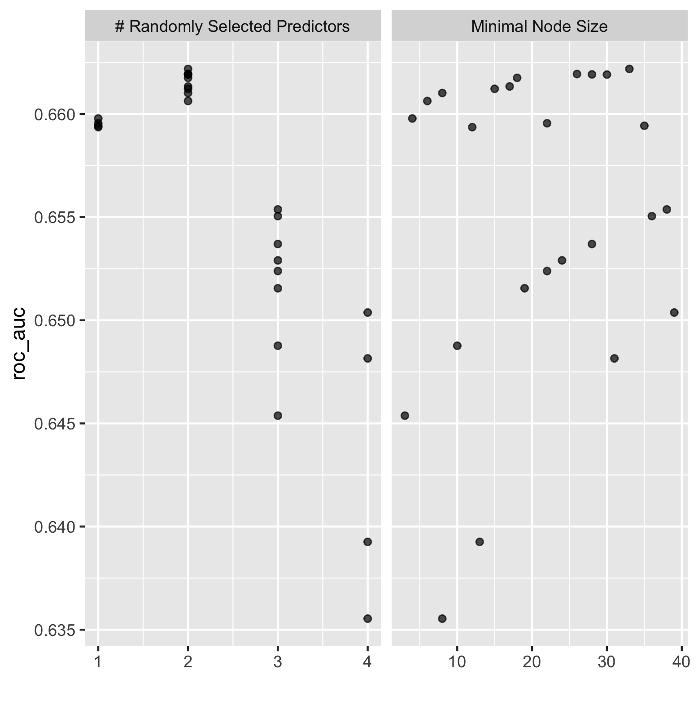

# Logistic Regression - Top_model

Based on this figure, the model with the largest area under curve was model one. Model five also had a large area under curve, however when calculating the area, model one was the largest. This indicates that model one was the most effective. I was able to use the feature selection penalty, however it did not appear to have a positive effect on the area under the curve (refer to image below). As the penalty increased, the area under the curve continued to decrease, indicating a less effective performance from the model. Ultimately, the lowest penalty value (0.00010) was the most effective for increasing area under the curve. 

# Random Forest 

The random forest models performed similiarly to the logistic regression models based on the area under the curve. This is illustrated in the figure above. The figure below overlays the area under curve for the five models for the random forest and logistic regression models. This further emphasizes their similiar performance. Based on this figure it appears as though the area under the curve was generally larger for the random forest models, indicating a better performance. 

The figure below illustrates the effect of minimal node size with randomly selected predictors.

The table below contains two figures demonstrating the effectiveness of the final random forest model. The final model slightly reduced the area under the curve from the first set of models. The bar chart on the right side of the table illustrates the importance each individual feature has on the predictive power of the final random forest model. The feature that was most important was age, followed by size, education and least important sex. 

Final Random Forest Fit  |  Importance of Features Contribution To Predictive Power of Random Forest Model
:-------------------------:|:-------------------------:
 | 

# Logistic Regression - Tensorflow

The figure below is a histogram of the age feature:

The figure below illustrates the value counts of the wealth feature:

This was the final result from the model:

The histogram below illustrates the predicted probabilities for the model. As seen in the figure, the frequency of small predicted probabilities is much higher than that of high predicted probabilities. 

# Gradient Boosting Model - Tensorflow

The figure below is the ROC curve for my gradient boosting model using tensorflow. As is expected from a functioning predictive model, this graph illustrates that my model is returning a higher true positive rate than a false positive rate. Therefore it is correctly classifying inputs more often than it is inncorrectly classifying them.

The figure below illustrates the distribution of each feature during training of the model.

This was the final result from the model:

# Results

The most effective model was the gradient boosting model. It had an accruacy of 75.23% which was the highest of the four models. It appeared as though the most important feature in predicting wealth was age. The least important was sex. This was true across all four models. All of the models were very similiar in thier outcomes. 
