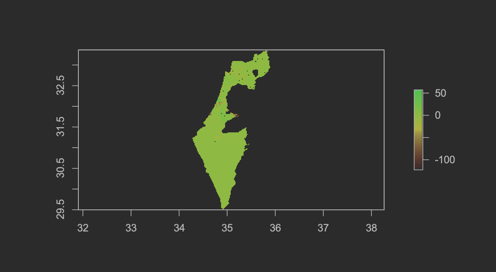
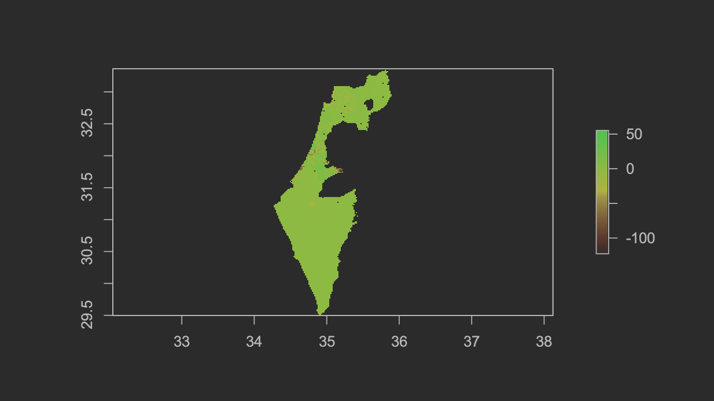
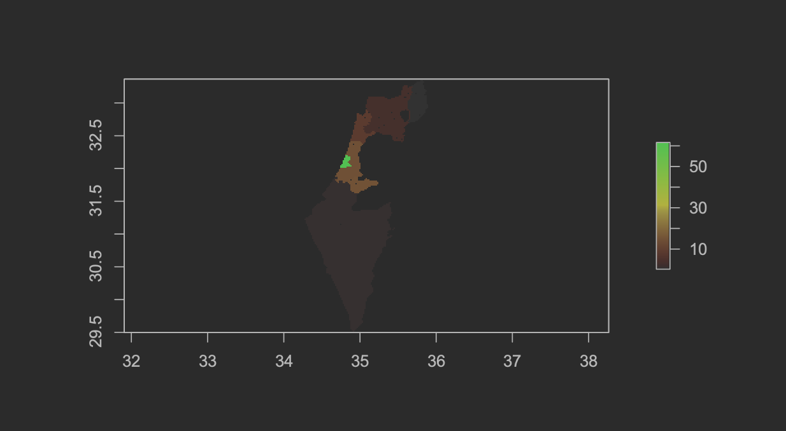
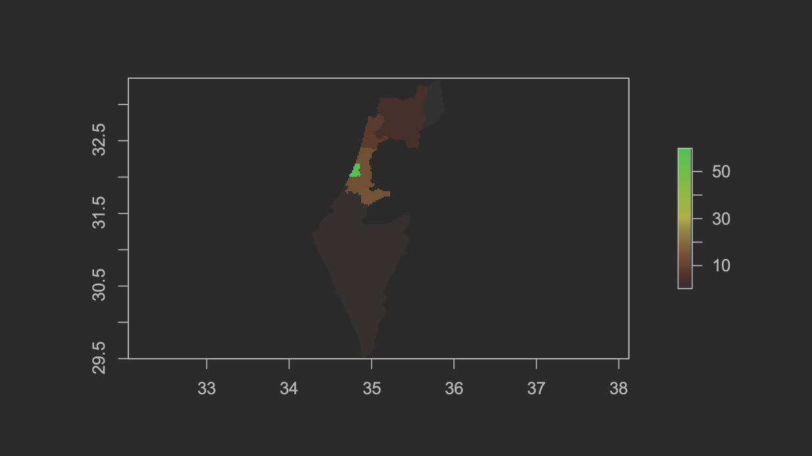
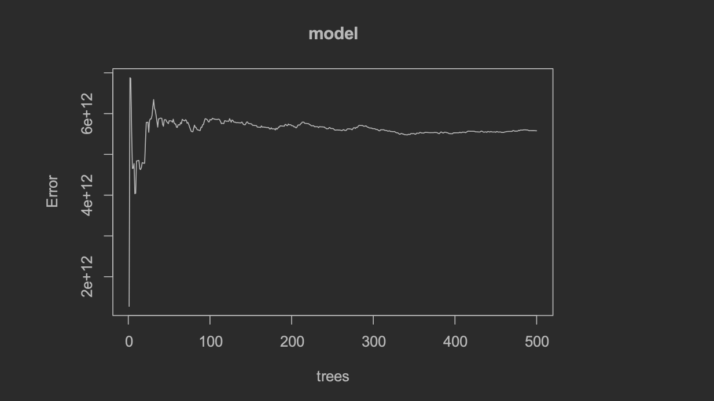
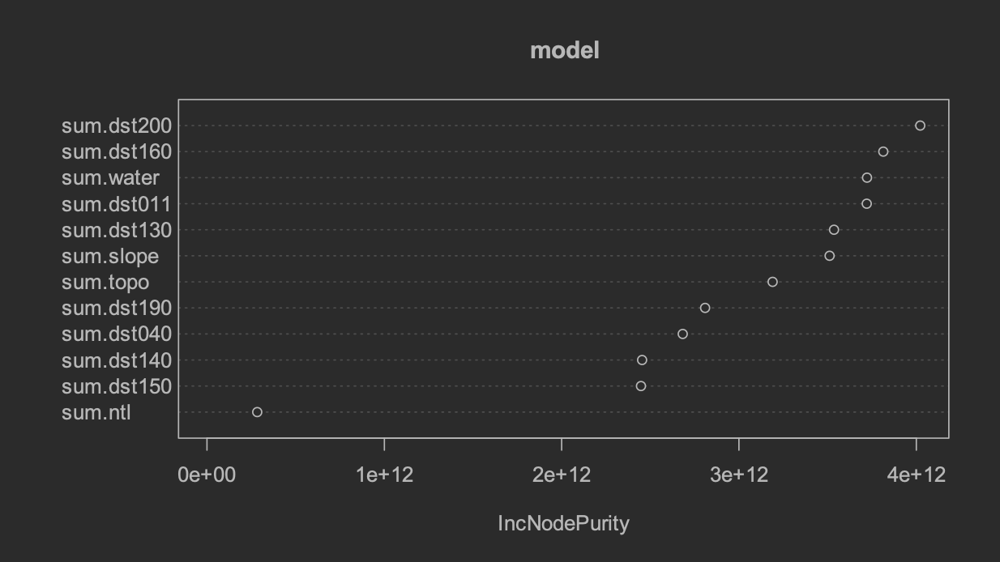
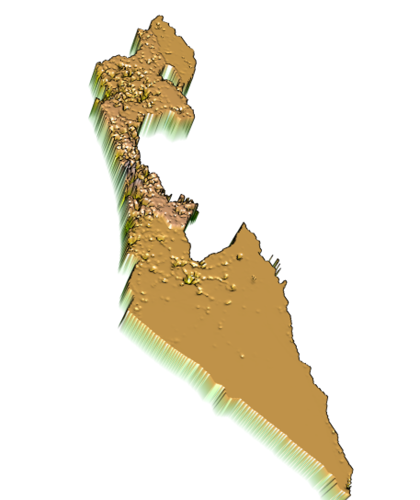
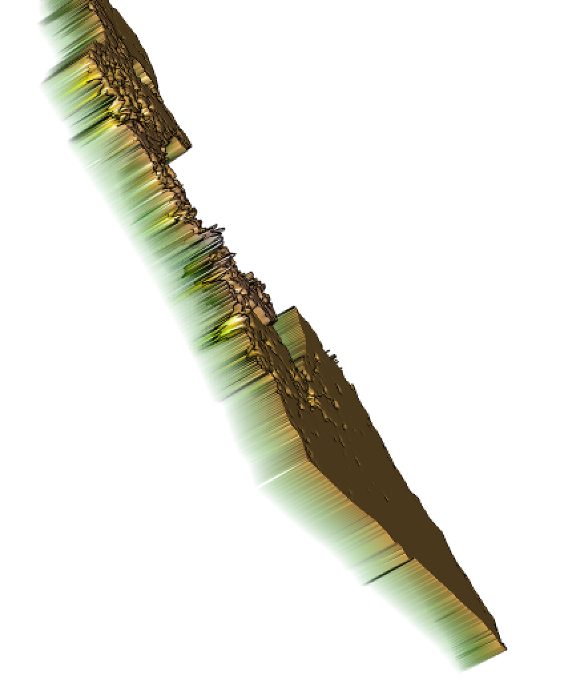
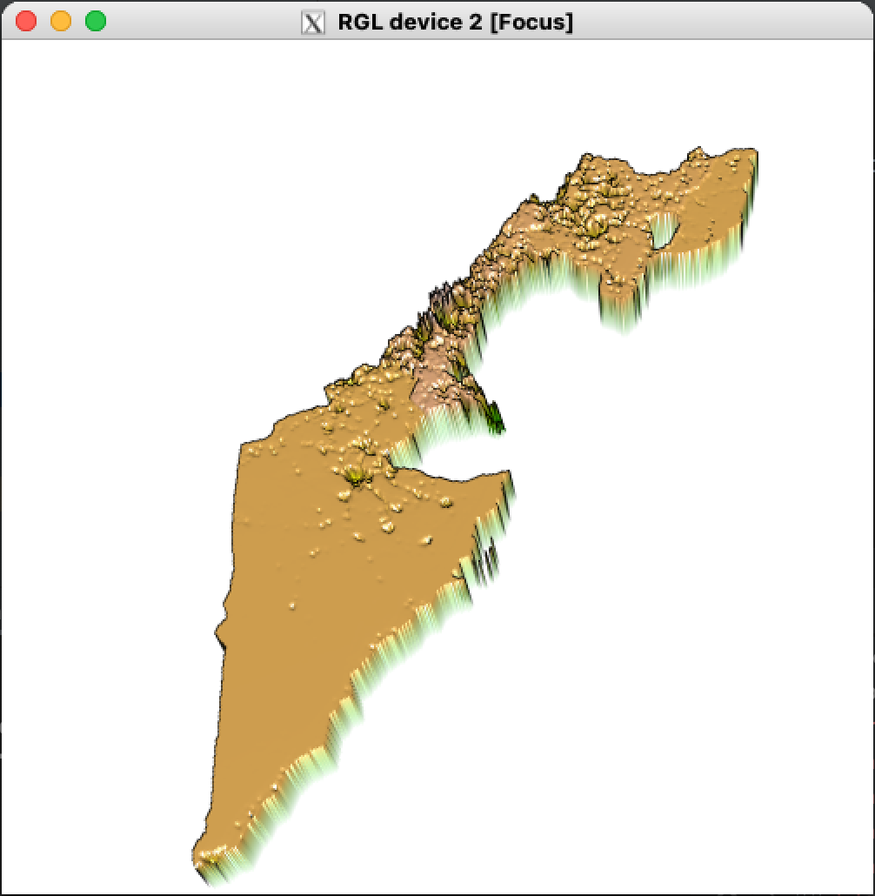
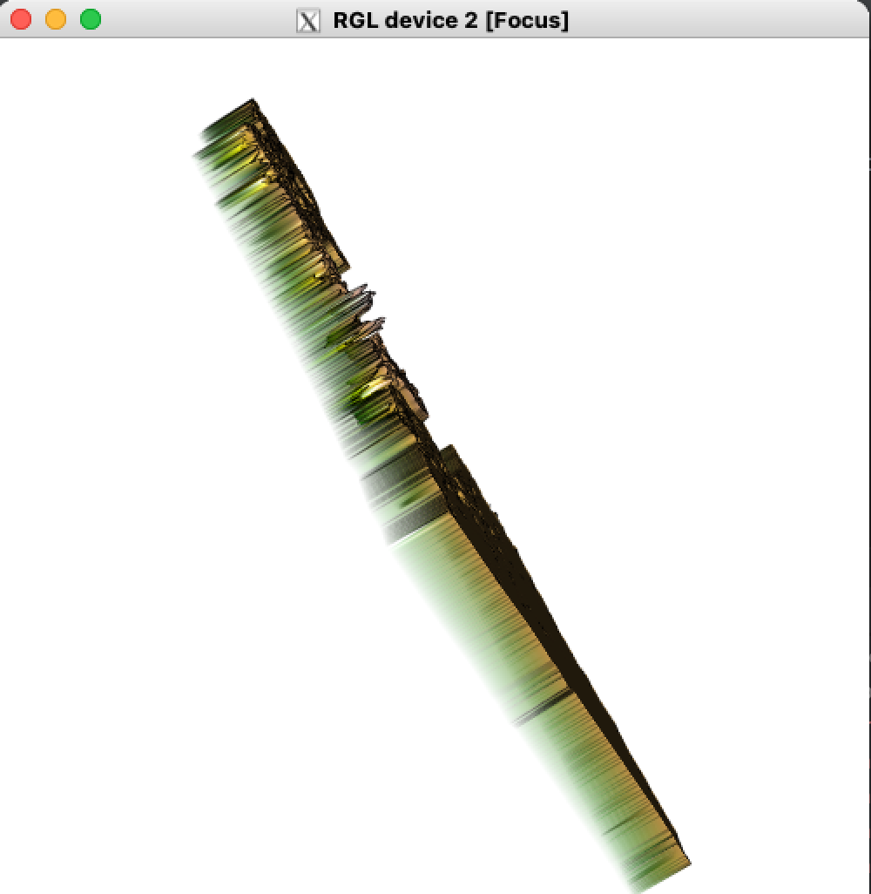

I predicted population values at 100 x 100 meter resolution throughout the country of Israel. I accomplished this by using administrative division data acquired from GADM, population data acquired from WorldPop, and potential covariate raster data from DHS. I utilized a linear regression and a random forest model and compared the two outputs.

The table below illustrates the two population sum outputs from my random forest model, and my linear regression. The outputs from the two models were remarkably similar. This was perhaps due to the granularity of the administrative division data. The highest granularity available for Israel was ADM One, which may account for the lack of discrepency between the two models.  

Population Sums - Random Forest  |  Population Sums - Linear Regression
:-------------------------:|:-------------------------:
 | 

The table below shows the two predicted plots of population in Israel. Once again, the models output was remarkably similar.

Population Plot - Random Forest  |  Population Plot - Linear Regression
:-------------------------:|:-------------------------:
 | 

The table below shows two evaluation plots of the random forest model. The plot on the left illustrates the relationship between number of trees and error in the random forest model. The plot on the right illustrates the variable importance for each potential covariate used in the random forest model. 

Trees V. Error Plot - Random Forest  |  Variable Importance Plot - Random Forest
:-------------------------:|:-------------------------:
 | 

The table below shows the accuracy of the linear regression model with a 3D visualization. Compared to the table below this one (accuracy of random forest) the linear regresion model appears to have less extreme discrepencies (higher peaks, and lower valleys) than the random forest model. Most of the discrepency is centered around the dense urban areas of Jerusalem and Tel Aviv.

Raster Visualization Angle One - Linear Regression  |  Raster Visualization Angle Two - Linear Regression
:-------------------------:|:-------------------------:
 | 

The table below shows the accuracy of the linear regression model with a 3D visualization.

Raster Visualization Angle One - Random Forest  |  Raster Visualization Angle Two - Random Forest
:-------------------------:|:-------------------------:
 | 

Overall, the two models performed very similarly. I think this is due to the low granularity of the administrative divsion data available for Israel. One difference between the two models was the wider range of variance with the random forest model, which was not as pronounced as with the linear regression model. 
